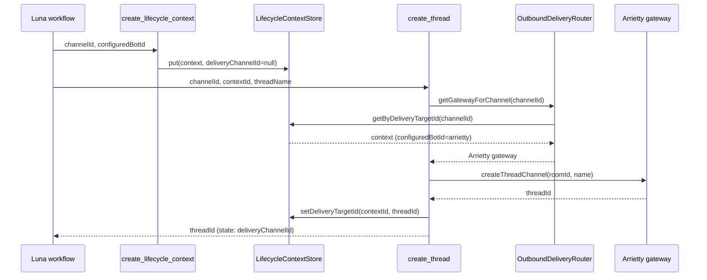

# Arrietty lifecycle-thread UX refinement pass

## Goal

- **Issue 1 (Option A):** Main intake room no longer shows the full launch acknowledgement; final user-facing message is a short redirect: `"Launching now. See <#{{channelId}}>."`  
  `LaunchCursorRunAction` stays unchanged; only the workflow’s **done** message changes.

- **Issue 2 (Option C):** Move `create_thread` after `provision_bot_instance` and `create_lifecycle_context`, and create the thread with the **lifecycle owner bot’s gateway** (so the anchor message and all later sends are from Arrietty, not Luna).

---

## 1. Workflow order and main-room message

**Current** [config/bots.yaml](config/bots.yaml) `luna_cursor` (indices 10–19):

- 10: `create_channel` → 11: branch → 12: `create_thread` → 13: `provision_bot_instance` → 14: `create_lifecycle_context` → 15: `post_channel_message` → 16: `launch_cursor_run` → 17: `done` `"{{launchMessage}}"` → 18/19: failure/cancel done.

**Target order:**

- 10: `create_channel` (storeIn: `channelId`)
- 11: branch (CHANNEL_CREATE_FAILED → 18, else → 12)
- 12: `provision_bot_instance` (storeIn: `instanceId`)
- 13: `create_lifecycle_context` (storeIn: `contextId`)
- 14: `create_thread` (storeIn: `deliveryChannelId`; bind e.g. `threadName: "Room updates"`)
- 15: `post_channel_message` (intro in lifecycle room/thread)
- 16: `launch_cursor_run` (storeIn: `launchMessage`; internal only, not shown in main room)
- 17: `done` with **short redirect**: `"Launching now. See <#{{channelId}}>."`
- 18: done "Could not create room."
- 19: done "Cancelled."

`channelId` in state at step 17 is still the lifecycle room from `create_channel`, so the redirect correctly mentions that room. No code changes in `LaunchCursorRunAction`; only the **done** step message and step order in YAML change.

---

## 2. Gateway for thread creation (lifecycle owner, not default)

Today [CreateThreadAction](src/main/java/com/vinekeepers/workflow/actions/CreateThreadAction.java) uses `router.getDefaultGateway()` (Luna). We need it to use the **lifecycle owner’s gateway** when that channel already has a lifecycle context.

**Mechanism:** After the reorder, when `create_thread` runs we have:

- `channelId` in state = lifecycle room (from `create_channel`)
- A context for that room already in [LifecycleContextStore](src/main/java/com/vinekeepers/state/LifecycleContextStore.java) (from `create_lifecycle_context`), with `configuredBotId` (e.g. `arrietty`).

Resolve the gateway via **router.getGatewayForChannel(channelId)**, which already falls back to default behavior when no room-specific gateway is available. So for the lifecycle room `channelId`, we get the lifecycle owner’s gateway (e.g. Arrietty) when a context exists; otherwise we get the default. No new API is required.

**CreateThreadAction change:**

- Resolve gateway as: when `channelId` is non-blank, use `router.getGatewayForChannel(channelId)` (which already falls back to the default when no room-specific gateway is available); when `channelId` is blank, use `router.getDefaultGateway()` so workflows that do not have a lifecycle room still work.
- Use that gateway for `createThreadChannel(parentChannelId, threadName)`.

So thread creation (and in JDA the anchor message) is done with the lifecycle owner’s gateway when the room has a context; otherwise the existing default behavior is preserved. No Arrietty-specific logic, only “channel with context → that context’s bot’s gateway.”

---

## 3. Updating the lifecycle context with the new thread id

Today, `create_lifecycle_context` runs **before** `create_thread` in the new order, so the context is first stored with `deliveryChannelId == null`. Then `create_thread` writes the thread id to **workflow state** only; the **LifecycleContext** in the store is never updated, so `getByDeliveryTargetId(threadId)` would not find the context and routing for thread-targeted sends would break.

**Required:** After a successful `create_thread`, the stored lifecycle context must get the new thread id as its delivery target.

- **LifecycleContext:** Add a copy-helper that preserves all fields but sets `deliveryChannelId`, e.g. `withDeliveryChannelId(String deliveryChannelId)`, returning a new instance (all current fields are final).
- **LifecycleContextStore:** Add **setDeliveryTargetId(String contextId, String deliveryTargetId)**:
  - Explicitly **ignore** null, blank, and **THREAD_CREATE_FAILED** so the sentinel cannot be indexed accidentally.
  - Otherwise: get context by `contextId`; if present, `put(context.withDeliveryChannelId(deliveryTargetId))`. Existing `put()` already maintains `deliveryTargetToContextId` (removes old mapping, adds new).
- **CreateThreadAction:** Inject [LifecycleContextStore](src/main/java/com/vinekeepers/state/LifecycleContextStore.java) in addition to the router. After a successful thread creation, if `contextId` is present in bind/state, call `lifecycleContextStore.setDeliveryTargetId(contextId, threadId)`. `contextId` is in state because step 13 (`create_lifecycle_context`) runs before step 14 (`create_thread`).
- **Bootstrap:** Register `create_thread` with the store:  
  `new CreateThreadAction(outboundDeliveryRouter, lifecycleContextStore)`.

No new workflow step; the same `create_thread` step both creates the thread and updates the store when `contextId` is available.

---

## 4. JDA anchor message

[JdaDiscordGateway.createThreadChannel](src/main/java/com/vinekeepers/connectors/JdaDiscordGateway.java) sends an anchor message in the parent channel then creates the thread from it. The author of that message is whichever gateway is used. By giving `CreateThreadAction` the lifecycle owner’s gateway (via `getGatewayForChannel(channelId)`), the anchor is sent by Arrietty’s gateway; no change to JDA code.

---

## 5. config/bots.yaml changes

- Reorder steps 12–17 as above (provision_bot_instance → create_lifecycle_context → create_thread → post_channel_message → launch_cursor_run → done).
- Set the step-17 **done** message to:  
  `"Launching now. See <#{{channelId}}>."`
- Keep `create_thread` bind e.g. `threadName: "Room updates"`, `storeIn: deliveryChannelId`.
- Optional: add a branch after `create_thread` on `deliveryChannelId == THREAD_CREATE_FAILED`; if not added, existing behavior (post_channel_message and monitor fall back to `channelId`) remains.

---

## 6. Tests

- **CreateThreadAction**
  - When `channelId` is in state and that channel has a lifecycle context (e.g. `configuredBotId: arrietty`), use gateway from `router.getGatewayForChannel(channelId)` (mock: verify the gateway used for `createThreadChannel` is the one returned for that channel, not the default).
  - When `channelId` is missing or no room-specific gateway is available, use default gateway (existing fallback behavior).
  - When thread is created and `contextId` is in state, call `lifecycleContextStore.setDeliveryTargetId(contextId, threadId)` (mock store, verify invocation).
  - When `contextId` is absent, do not call `setDeliveryTargetId`.
- **LifecycleContextStore**
  - **setDeliveryTargetId** ignores null, blank, and THREAD_CREATE_FAILED (no update, sentinel never indexed); with a valid (contextId, threadId), updates the context and `getByDeliveryTargetId(threadId)` returns it; `getByChannelId(roomId)` still returns the same context.
- **LifecycleContext**
  - `withDeliveryChannelId(id)` returns a new context with that `deliveryChannelId` and other fields unchanged.
- **Workflow/config**
  - Document or assert luna_cursor step order (create_channel → … → create_lifecycle_context → create_thread → … → done with redirect).
- **Main-room message**
  - Assert or document that the final done message is the short redirect text, not `{{launchMessage}}` (e.g. in a test that runs the workflow or in config/spec docs).

---

## 7. Summary diagram

---

## 8. Scope discipline

- Do not change `LaunchCursorRunAction` behavior.
- Do not replace or rename `deliveryChannelId`.
- Do not add multi-thread or multiple delivery targets; single thread per context only.
- Only add the minimal store/context API needed: `withDeliveryChannelId`, `setDeliveryTargetId` (with null/blank/sentinel ignored), and CreateThreadAction’s use of lifecycle gateway + store update.

---

## 9. Files to touch

| Area | File | Change |
|------|------|--------|
| Config | [config/bots.yaml](config/bots.yaml) | Reorder steps 12–17; set done step 17 message to short redirect. |
| Context | [LifecycleContext.java](src/main/java/com/vinekeepers/state/LifecycleContext.java) | Add `withDeliveryChannelId(String)`. |
| Store | [LifecycleContextStore.java](src/main/java/com/vinekeepers/state/LifecycleContextStore.java) | Add `setDeliveryTargetId(String contextId, String deliveryTargetId)`; ignore null, blank, THREAD_CREATE_FAILED. |
| Action | [CreateThreadAction.java](src/main/java/com/vinekeepers/workflow/actions/CreateThreadAction.java) | Use `getGatewayForChannel(channelId)` (already has default fallback); inject store; after success, call `setDeliveryTargetId(contextId, threadId)` when contextId in state/bind. |
| Bootstrap | [Bootstrap.java](src/main/java/com/vinekeepers/core/Bootstrap.java) | Pass `lifecycleContextStore` into `CreateThreadAction`. |
| Tests | CreateThreadActionTest, LifecycleContextStoreTest, LifecycleContext (if needed) | Gateway resolution by channel, fallback, store update; setDeliveryTargetId (incl. sentinel ignored); withDeliveryChannelId. |
| Docs/specs | README and/or workflow-registry / plan | Note new step order and redirect message. |
