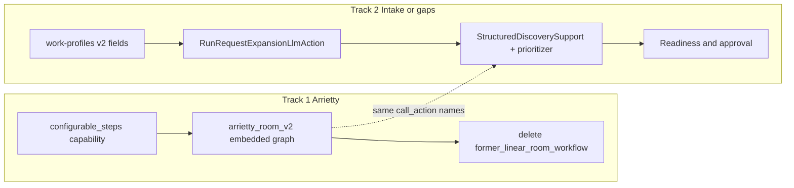
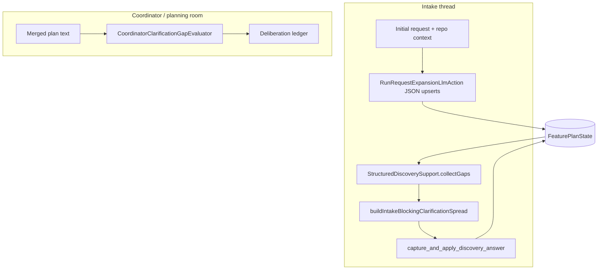

# Combined plan: Arrietty v2 cutover and gap-driven planning intake

## How the two tracks fit together

- **Track 1 (Arrietty)** is **workflow engine + YAML + routing**: production must stop delegating to `former_linear_room_workflow` and run the real coordinator spine inside `arrietty_room_v2` via embedded `ConfigurableWorkflowRunner` steps.
- **Track 2 (intake/gaps)** is **plan state, profile schema, actions, and readiness**: the same spine (after port) continues to call `get_structured_discovery_gaps`, `build_insight_discovery_agenda`, `capture_and_apply_discovery_answer`, expansion LLM, etc.—those behaviors become richer without a second legacy graph to update.

**Recommended sequencing**

1. **Track 1 first** (configurable_steps + YAML migration + delete legacy + ingress mode + Arrietty-focused specs/tests). New workflow flags (e.g. `discoveryMarginalStop`) and branches land once in the v2 embedded graph.
2. **Track 2** (profile fields, expansion schema, gap engine, loop stop, governance gates) on top of the v2-only tree. If Track 1 slips, Track 2 can still ship against `linear_workflow_ref` temporarily, at the cost of dual YAML touch points.

---

# Part A — Arrietty workflow port and legacy cutover

## Constraint (current engine)

[`GraphWorkflowRunner`](src/main/java/com/vinekeepers/workflow/v2/GraphWorkflowRunner.java) only executes:

- `legacy_action` → [`CallActionStep`](src/main/java/com/vinekeepers/workflow/steps/CallActionStep.java) (no prompts)
- `linear_workflow_ref` → nested [`ConfigurableWorkflowRunner`](src/main/java/com/vinekeepers/workflow/ConfigurableWorkflowRunner.java) over a **sibling** workflow map entry

Production Arrietty behavior (prompts, `capture_field`, `branch`, `done` messages) today lives entirely in the **linear** runner. **You cannot** express that orchestration in v2 phases using only `legacy_action` without either keeping `linear_workflow_ref` or adding a new capability.

**Required engine work (non–Arrietty-specific):** add a v2 capability kind (name TBD, e.g. `configurable_steps`) that:

- Declares an **inline** `steps: [...]` list on the capability (same step map shape as v1 YAML: `prompt_for_field`, `capture_field`, `branch`, `call_action`, `done`, etc.).
- Runs a `ConfigurableWorkflowRunner` built from those steps (reuse `buildSteps` / same `WorkflowDefinition` llm + templates as the parent v2 workflow where applicable).
- **Segment lifecycle / step index:** today v2 and linear share one [`ConfigurableWorkflowState`](src/main/java/com/vinekeepers/workflow/ConfigurableWorkflowState.java) (`stepIndex` + v2 keys in `data`). When **entering** a new `configurable_steps` capability, reset `stepIndex` to `0` and `markActive()` if this segment is not the one currently paused (track e.g. `__v2_activeStepsCapId` + pipeline index in `data` so WAIT/RESUME stays stable).
- **Completion UX:** reuse the same “forward non-empty completion through empty terminal phases” behavior as `linear_workflow_ref` ([`completedRunHasUserVisibleOutcome`](src/main/java/com/vinekeepers/workflow/v2/GraphWorkflowRunner.java) + [`collapseThroughEmptyTerminalPhases`](src/main/java/com/vinekeepers/workflow/v2/GraphWorkflowRunner.java)) so `done` messages are not dropped when the outer phase is `done`.

Extend [`WorkflowV2CapabilityModel`](src/main/java/com/vinekeepers/workflow/v2/WorkflowV2CapabilityModel.java) + [`WorkflowV2Loader`](src/main/java/com/vinekeepers/workflow/v2/WorkflowV2Loader.java) to carry optional `steps`. Update [`GraphWorkflowRunnerTest`](src/test/java/com/vinekeepers/workflow/v2/GraphWorkflowRunnerTest.java) with cases: WAIT from embedded prompt, resume, completion message forwarding through terminal `done` phase.

**`linear_workflow_ref` cleanup:** keep generic support and tests ([`GraphWorkflowRunnerTest.linearWorkflowRefForwardsNonEmptyDoneMessageInsteadOfDroppingToEmptyOuterCompletion`](src/test/java/com/vinekeepers/workflow/v2/GraphWorkflowRunnerTest.java)) for other workflows; **do not** remove `collapseThroughEmptyTerminalPhases` unless nothing uses it—only remove **docs/spec framing** that production Arrietty depends on delegation.

---

## Legacy graph map → target v2 shape

Historically the coordinator spine lived in a standalone linear workflow (removed). Production now uses [`arrietty_room_v2`](config/bots.yaml) only (phases + embedded `configurable_steps`).

| Legacy region (approx.) | Behavior | Target v2 phase (intent) |
| ----------------------- | -------- | ------------------------ |
| 0–1 | Workspace intro post | `planning_ingress` (already have hydrate/ensure/spread; optional: fold redundant first branch + post into ingress or first segment) |
| 2 | Branch: `coordinatorKickoff` → bootstrap path, intake thread → main spine, else fallback | `planning_ingress` — drive via **canonical** `planningIngressMode` + rules, not scattered booleans |
| 3–24 | Proposals, confirm loop, structured gaps, single-question insight path | `planning_prepare` + `planning_clarification` (conceptually; see cyclic note below) |
| 25–48 | `mark_intake_discovery_complete`, `execute_planning_room_cycle`, progress, clarification merge, packet post, critique/readiness branches | `planning_cycle` + `planning_review` |
| 49–67 | Blocked / depth retry, human-decision / readiness checkpoint, approval gate | `planning_review` + `planning_approval` |
| 57–84 | Approval choices, persist, launch, failure branches | `planning_approval` + `planning_launch` |
| 70–74 | `coordinator_intake_bootstrap` + branch into main spine | `planning_ingress` kickoff normalization |

**Cyclic graph note:** The legacy graph **loops** (e.g. revise → `execute_planning_room_cycle` at step 26). A single `ConfigurableWorkflowRunner` instance naturally supports that. **Splitting into multiple v2 phases** while preserving loops requires either (a) one embedded `configurable_steps` segment that contains the whole cyclic graph, or (b) new engine semantics to **exit a segment** and **re-enter** another phase with a clean step index (not present today). **Pragmatic sequencing:**

1. **Cutover:** `planning_ingress` (legacy_action pipeline) + **one** `configurable_steps` capability containing the migrated legacy steps (minus duplicate hydrate/ensure/spread if still redundant) + `done` terminal — removes `workflowRef: former_linear_room_workflow` and deletes the legacy workflow block.
2. **Architecture polish (optional follow-up):** refactor internal “back edges” into segment exits + v2 `rulesets` transitions to reach the 8-phase layout you specified (prepare / cycle / clarification / review / approval / launch as separate phases), once segment re-entry is defined.

---

## Ingress mode model (B)

Today [`HydratePlanningSessionAction`](src/main/java/com/vinekeepers/workflow/actions/HydratePlanningSessionAction.java) sets `planningIngressMode` to payload value, else `SYNTHETIC_KICKOFF`, else `USER_MESSAGE`, else `""`.

**Plan:** introduce **canonical** string values (e.g. `kickoff`, `intake_reply`, `approval_reply`, `fallback`) mapped from:

- Synthetic event payload ([`StartCoordinatorPlanningAction`](src/main/java/com/vinekeepers/workflow/actions/StartCoordinatorPlanningAction.java) already sets `SYNTHETIC_KICKOFF` — align naming).
- Thread message vs interaction, `waitingForField`, and persisted plan stage (`canonicalPlanningIntakeStage` / approval-related state) so approval-thread replies are not mis-routed as generic intake.

Wire v2 **rulesets** ([`WorkflowRulesEngine`](src/main/java/com/vinekeepers/workflow/v2/WorkflowRulesEngine.java)) on phase exhaustion using `equals` / `truthy` on those keys for transitions **once** multi-phase segmentation exists; for the **single-segment** cutover, replace the legacy step-2 branch with branches on the normalized `planningIngressMode` (same behavior, explicit mode).

---

## Config / deletion

- [`config/bots.yaml`](config/bots.yaml): expand `arrietty_room_v2` with real `phases` + `capabilities`; **remove** `cap_linear_room` and **delete** the entire `former_linear_room_workflow` workflow key.
- Grep: ensure **no** `workflowRef: former_linear_room_workflow` remains in repo (production paths).
- Bot `arrietty` already uses `workflowRef: arrietty_room_v2` — unchanged.

---

## Part A — Specs, docs, tests

Update acceptance criteria that today mandate v2→legacy delegation and branch-index contracts, including:

- [`specs/workflow-registry.yml`](specs/workflow-registry.yml) — especially REQ-WORKFLOW-002 bullets referencing `linear_workflow_ref` to `former_linear_room_workflow`, rollback to legacy, and step-index guards.
- [`specs/config-registry.yml`](specs/config-registry.yml) — parallel Arrietty / v2 / legacy wording.
- [`README.md`](README.md) (work profile / Arrietty paragraph).
- [`mkdoc/features/domain/workflow/workflow.md`](mkdoc/features/domain/workflow/workflow.md), [`workflow-steps.md`](mkdoc/features/domain/workflow/workflow-steps.md), [`cursor-gathering/how-it-works.md`](mkdoc/features/domain/workflow/cursor-gathering/how-it-works.md), [`cursor-gathering/change-log.md`](mkdoc/features/domain/workflow/cursor-gathering/change-log.md), [`cursor-gathering/tests.md`](mkdoc/features/domain/workflow/cursor-gathering/tests.md), [`mkdoc/architecture.md`](mkdoc/architecture.md) if it echoes the same.

**Rule:** specs use **existing** REQ keys only—**revise statement/criteria text**, do not invent new spec keys ([guardrails](.cursor/rules/guardrails.mdc)).

### Part A — Tests

- **Replace** [`ArriettyRoomWorkflowYamlTest`](src/test/java/com/vinekeepers/config/ArriettyRoomWorkflowYamlTest.java): remove production contracts on `former_linear_room_workflow` step indices and coordinator anchor indices (73/74/26). New tests should:
  - Assert `workflows.arrietty_room_v2` exists; **no** capability with `kind: linear_workflow_ref` and `workflowRef: former_linear_room_workflow`.
  - Assert expected **v2** structure: `entryPhase`, phases, pipelines, and that critical `call_action` names still appear **inside** embedded steps or `legacy_action` caps (grep/parse YAML map).
  - Retain **behavioral** YAML guards that are not index-based: e.g. no `prompt_for_field` containing the forbidden “Add scope” / “must-haves” kickoff solicitation (scan embedded steps).
- **Add/extend** runner or integration tests for: autonomous kickoff path, single clarification question, duplicate Decision suppression, blocker-only pre-first-pass discovery, packet dedupe, approval before launch, revise/reject routing — reusing existing action-level tests where they already cover logic; add thin workflow-level tests where behavior is YAML-routing-dependent.
- [`VinekeepersEngineTest`](src/test/java/com/vinekeepers/core/VinekeepersEngineTest.java) already references `arrietty_room_v2` — ensure it still loads after YAML change.

**Optional:** if any test **needs** a tiny linear graph, define it **inline** under a test-only workflow in test resources or programmatic maps (not production `bots.yaml`).

### Part A — Verification checklist

- No production path uses **legacy branch numbering** (legacy workflow gone; v2 has no sibling ref).
- Kickoff path: confirm via YAML scan + `HydratePlanningSessionAction` / ingress tests — no generic optional scope prompt.
- Clarification: rely on existing quality-gate tests + YAML scan for duplicate “Decision” headings if encoded in templates.
- Launch: `evaluate_planning_approval_gate` / `launch_cursor_run` ordering remains in migrated steps; add regression test if gap.

Run repo validation from AGENTS.md: `npm run validate-specs`, `npm run validate-drift`, `mvn test`, `mvn compile`, `npm run validate-docs`.

### Part A — Deliverable note

Add a short note (e.g. under `mkdoc/.../cursor-gathering/` or PR description) summarizing:

- Legacy segment → v2 phase mapping (and whether cutover uses one coordination segment vs full 8-phase split).
- Deleted: `former_linear_room_workflow` workflow, delegation capability, branch-index tests.
- Retained: generic `linear_workflow_ref` + completion forwarding for non-Arrietty workflows.

---

# Part B — Gap-driven structured planning intake

## Current baseline (what already exists)

- **Canonical plan:** [`FeaturePlanState`](src/main/java/com/vinekeepers/state/planning/FeaturePlanState.java) already holds `requirements`, `artifacts` (from the work profile), `assumptions`, `issues`, `risks`, `decisions`, `unresolvedQuestions`, workspace linkage, and confidence/approval metadata. Tracked entity types exist: [`PlanAssumption`](src/main/java/com/vinekeepers/state/planning/PlanAssumption.java), [`PlanIssue`](src/main/java/com/vinekeepers/state/planning/PlanIssue.java), [`PlanRisk`](src/main/java/com/vinekeepers/state/planning/PlanRisk.java), [`PlanDecision`](src/main/java/com/vinekeepers/state/planning/PlanDecision.java).
- **Profile schema:** [`software_feature_planning_v2`](config/work-profiles.yaml) defines narrative, architecture, risk, open questions, decisions, etc., but several checklist items are **merged into single text fields** (e.g. `feature_summary` = “problem / goal”, `scope_summary` = scope + non-goals, `risk_summary` rolls rollout into one blob).
- **Intake population:** [`RunRequestExpansionLlmAction`](src/main/java/com/vinekeepers/workflow/actions/RunRequestExpansionLlmAction.java) already emits JSON with `upserts` into artifacts; the **LLM schema is not aligned** with distinct concepts (problem, goals, stakeholders, dependencies, rollout, etc.).
- **Discovery gaps:** [`StructuredDiscoverySupport.collectGaps`](src/main/java/com/vinekeepers/workflow/discovery/StructuredDiscoverySupport.java) today adds **required-field** and **workspace** gaps only; assumptions/issues are explicitly *excluded* from gap emission to avoid infinite loops. [`buildIntakeBlockingClarificationSpread`](src/main/java/com/vinekeepers/workflow/discovery/StructuredDiscoverySupport.java) asks **one** question, but only for `REQUIRED_FIELD` / `WORKSPACE` severities `HIGH`/`BLOCKER`.
- **Coordinator clarification:** [`CoordinatorClarificationGapEvaluator`](src/main/java/com/vinekeepers/workflow/planning/CoordinatorClarificationGapEvaluator.java) + [`PlanningCyclePipeline`](src/main/java/com/vinekeepers/workflow/planning/PlanningCyclePipeline.java) implement **declarative text-trigger** gaps over merged narrative — useful, but **orthogonal** to structured plan-state gap analysis.
- **Readiness:** [`PlanReadinessCalculator`](src/main/java/com/vinekeepers/workflow/planreview/PlanReadinessCalculator.java) already factors **open discovery gaps**, **blocking critique findings**, **blocking issues count**, and **open assumptions** (including HIGH / volume thresholds) into readiness and confidence; risks/decisions are less central today.

## Design choices (defaults for this iteration)

1. **Where to store the checklist:** Prefer **extending `software_feature_planning_v2` artifacts** (new or split fields under existing sections) so `GenericReadinessEvaluator`, packet depth, and existing upsert machinery keep working. Avoid a parallel opaque JSON blob unless you hit serialization or migration pain.
2. **Two gap layers, one ranking concept:** Keep **deterministic** gaps (missing/invalid structured fields, workspace, contradictions detectable without LLM) in Java; allow **LLM-produced gap hints** (optional, bounded) as `DiscoveryGap` rows with `source` = e.g. `LLM_HINT` that still reference artifact/field or governance targets. Unify **sorting / “next question”** in one place (`StructuredDiscoverySupport` or a small new `PlanningGapPrioritizer`).
3. **Governance entities:** Prefer **upserting** `PlanRisk` / `PlanDecision` / `PlanAssumption` from expansion and clarification merges, not only free text in sections — sections remain human-readable; lists are machine-checkable.

## Workstream B1 — Structured intake → real fields

- **Profile:** Add explicit fields (or a dedicated narrative subsection) for: problem statement, goals, non-goals, stakeholder impact, dependencies, rollout concerns — mapping 1:1 where it does not duplicate `acceptance_criteria` / `open_questions` / `components_impacted`. Update [`config/work-profiles.yaml`](config/work-profiles.yaml) and [`ArtifactStateFactory`](src/main/java/com/vinekeepers/profile/ArtifactStateFactory.java) behavior only if new artifacts/sections require it.
- **Expansion LLM:** Revise the JSON schema and merge logic in [`RunRequestExpansionLlmAction`](src/main/java/com/vinekeepers/workflow/actions/RunRequestExpansionLlmAction.java) so `upserts` populate the new fields; keep backward compatibility for older sessions (skip unknown keys; default empty).
- **Optional:** On first expansion, seed **PlanRisk** / **PlanDecision** / **PlanAssumption** rows from structured LLM output (with `source` metadata), not only `risk_summary` text.

## Workstream B2 — Gap-driven clarification (state + repo)

- **Extend gap collection** in [`StructuredDiscoverySupport`](src/main/java/com/vinekeepers/workflow/discovery/StructuredDiscoverySupport.java) (and small helpers) to emit additional `DiscoveryGap` kinds, for example:
  - **Missing / weak:** beyond `required`, use `minWords` / placeholder heuristics (reuse patterns from [`GenericReadinessEvaluator`](src/main/java/com/vinekeepers/workflow/readiness/GenericReadinessEvaluator.java) / [`PlanningPlaceholderDetection`](src/main/java/com/vinekeepers/workflow/planning/PlanningPlaceholderDetection.java)) as `QUALITY` gaps with clear `userFacingDetail`.
  - **Repo context:** if `planningRepoEvidenceJson` / workspace signals ([`SpreadPlanWorkspaceSignalsAction`](src/main/java/com/vinekeepers/workflow/actions/SpreadPlanWorkspaceSignalsAction.java)) show missing slug, unclear paths, or workspace `BLOCKED`, emit targeted gaps (some already exist as `WORKSPACE`).
  - **Governance:** **OPEN** assumptions with HIGH severity, **BLOCKING** issues → `GOVERNANCE` gaps with stable `gapId` and apply semantics (confirm/waive/update record), distinct from “missing field.”
  - **Contradiction / ambiguity (phase 1):** start with **cheap deterministic rules** (e.g. non-goals mention same deliverable as goals; acceptance criteria empty while scope claims “complete feature”). Defer full NLP unless needed.
- **Wire apply path:** extend [`CaptureAndApplyDiscoveryAnswerAction`](src/main/java/com/vinekeepers/workflow/actions/CaptureAndApplyDiscoveryAnswerAction.java) (or a dedicated action) for `GOVERNANCE` / new kinds — e.g. confirm assumption, resolve issue, append risk mitigation — persisting via `FeaturePlanStateStore` updates.
- **Coordinator alignment (later slice):** Optionally map the same `DiscoveryGap` taxonomy into coordinator UX so “canonical” and intake share vocabulary; first slice can stay intake-only to limit blast radius.

## Workstream B3 — Guided loop: next best question + stop rule

- **Ranking:** Introduce explicit **priority** (or sort key) on gaps: blocking power, whether gap blocks readiness, information gain heuristic (e.g. governance before optional narrative polish), and **staleness** (don’t re-ask the same normalized question — see `planningPreviousClarificationQuestionText` / stuck detection in workflow behavior).
- **Marginal value / stop:** After each `capture_and_apply_discovery_answer`, recompute gap set; if **fingerprint** of top-gap set unchanged for N rounds **or** `PlanReadinessCalculator` / depth + governance gates satisfied, clear `discoveryHasOpenGaps` / set a new workflow flag (e.g. `discoveryMarginalStop`) so YAML branches exit discovery without “bureaucratic wallpaper.” Expose optional **max rounds** in profile YAML. **After Part A cutover**, wire these branches only in `arrietty_room_v2` embedded steps (no legacy duplicate).
- **Single question:** Keep [`buildIntakeBlockingClarificationSpread`](src/main/java/com/vinekeepers/workflow/discovery/StructuredDiscoverySupport.java) as the single-question choke point; widen allowed `kind` values as new gap types are added.

## Workstream B4 — Entities drive readiness and approval

- **Tighten gates:** In [`PlanReadinessCalculator`](src/main/java/com/vinekeepers/workflow/planreview/PlanReadinessCalculator.java) and [`EvaluatePlanningApprovalGateAction`](src/main/java/com/vinekeepers/workflow/actions/EvaluatePlanningApprovalGateAction.java) / [`PlanningApprovalGateSupport`](src/main/java/com/vinekeepers/workflow/planreview/PlanningApprovalGateSupport.java), ensure:
  - **Unresolved BLOCKING issues** and **required OPEN assumptions** block or force `NEEDS_HUMAN_DECISION` / `CONDITIONALLY_READY` consistently with Discord copy ([`PlanningUserFacingCopy`](src/main/java/com/vinekeepers/workflow/planreview/PlanningUserFacingCopy.java)).
  - **PlanRisk** rows with status `OPEN` and high severity optionally mirror blocking behavior (configurable via profile).
  - **PlanDecision** “PENDING” items (if you add that status) gate approval until resolved or explicitly waived.
- **Ownership:** Use existing `owner` on [`PlanAssumption`](src/main/java/com/vinekeepers/state/planning/PlanAssumption.java) (and analogous fields on other types if present) — populate from coordinator role or explicit user id when merging clarifications.

## Part B — Specs, docs, tests

- Update acceptance criteria under **REQ-STATE-001** / workflow requirements in [`specs/state-registry.yml`](specs/state-registry.yml) and [`specs/workflow-registry.yml`](specs/workflow-registry.yml) only when behavior is contractually new (new gap kinds, new approval semantics)—**merge editorially** with Part A workflow-registry edits (one PR should not fight itself).
- Sync [`mkdoc/features/domain/workflow/cursor-gathering.md`](mkdoc/features/domain/workflow/cursor-gathering.md) (or the active planning feature page) and relevant change logs when runtime behavior changes.
- Tests: extend [`IntakeBlockingClarificationTest`](src/test/java/com/vinekeepers/workflow/discovery/IntakeBlockingClarificationTest.java), gap/readiness tests, [`PlanReadinessEvaluatorTest`](src/test/java/com/vinekeepers/workflow/planreview/PlanReadinessEvaluatorTest.java), expansion action tests; run full validation suite.

## Part B — Suggested sequencing (minimize risk)

1. Profile + expansion schema (visible user value, mostly localized).
2. Deterministic new gaps + prioritizer + widened capture/apply (intake loop).
3. Readiness/approval wiring for governance entities.
4. Marginal-value stop + profile tuning (YAML in v2 only after Part A).
5. Optional: coordinator pipeline convergence and richer contradiction/LLM-hint gaps.

---

# Unified validation

Run: `npm run validate-specs`, `npm run validate-drift`, `mvn test`, `mvn compile`, `npm run validate-docs` after Part A and again after Part B (or once at end if single PR).
