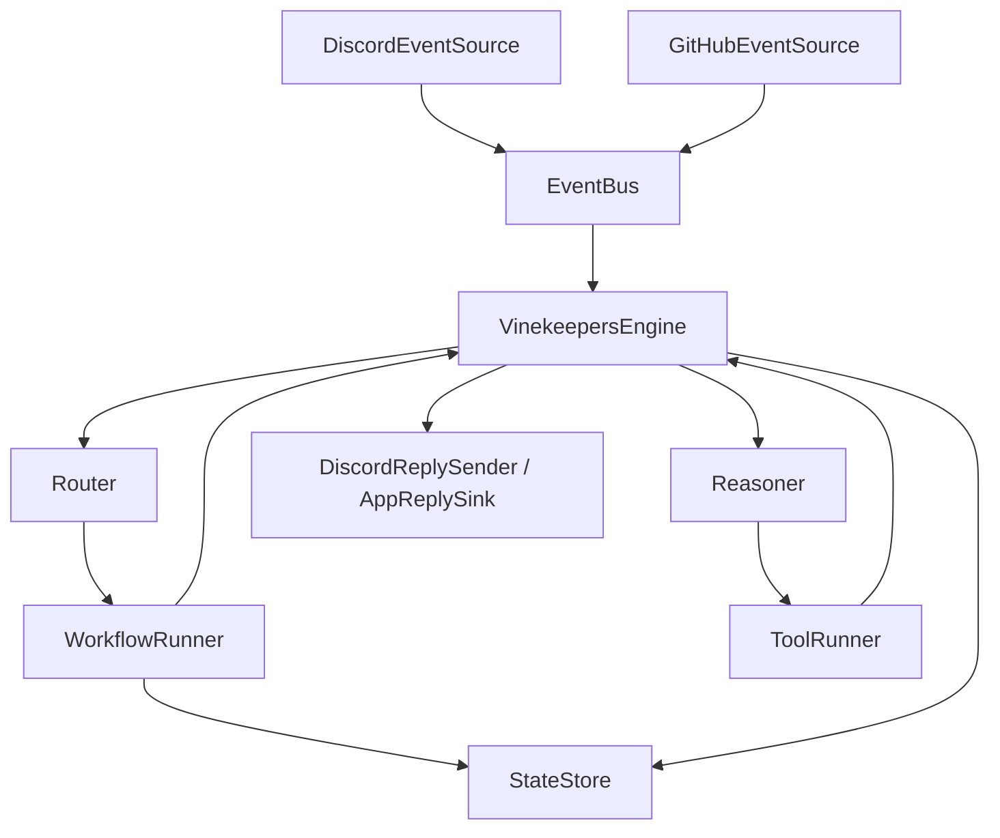

# Architecture

# Overview

Vinekeepers is an event-driven bot framework built around spec-traced Java components and YAML-configured bots. The runtime loads configuration, routes incoming events to matching bots, runs workflow and reasoner stages, executes approved tools, persists per-session state, and sends replies through the active connector path.

# System context

- **External systems:** Discord, GitHub, the local file system for `.env` and `config/bots.yaml`, and the Java 21 plus Maven runtime.
- **Boundaries:** Connectors translate external payloads into internal `Event` objects, the engine orchestrates routing and execution, and outbound side effects are limited to approved tools or connector reply interfaces.

# Major subsystems

- **Core runtime:** `VinekeepersApp`, `Bootstrap`, `VinekeepersEngine`, `EventBus`, `Router`, and `ConfigLoader` wire the application and coordinate the per-event execution loop.
- **Interactions and reply:** Package `com.vinekeepers.interactions` provides platform-neutral reply model: `OutboundResponse`, `ResponseIntent` (PresentChoices, ConfirmAction, CollectText, CollectForm, ShowActions, ShowStatus), `ReplyTarget` (ChannelTarget, InteractionTarget), `Capabilities`, and the connector contract `AppReplySink` (respondImmediately, sendFollowUp, updateMessage, openModal, getCapabilities).
- **Bot model:** `BotDefinition`, `Persona`, `ModelProfile`, `Routing`, `ToolPolicy`, `MemoryPolicy`, `ConversationMode`, and normalized event context define how each bot behaves and what it can do.
- **Workflow and state:** `WorkflowRunnerFactory`, `WorkflowRunner`, `ConfigurableWorkflowRunner`, step implementations, session key strategies, and `StateStore` support multi-turn and single-event flows.
- **Reasoner and tools:** `ReasonerInput`, `ReasonerOutput`, `ProposedToolCall`, `ToolRegistry`, and `ToolRunner` support policy-checked post-workflow decision making.
- **Connectors:** `DiscordEventSource`, `DiscordReplySender`, `DiscordAppReplySink`, and `GitHubEventSource` bridge external systems and internal events. The engine uses the connector **AppReplySink** contract (lifecycle operations) for rich replies; Discord adapter owns platform timing and may auto-defer on interaction receive.

# Runtime flows

1. Startup loads `.env`, then `Bootstrap` creates the event bus, state store, router, engine, tool registry, and workflow runner factory before starting configured connectors.
2. A connector publishes an `Event`; `VinekeepersEngine` receives it and asks `Router` to match the event against normalized routing filters and bot definitions.
3. For each matching bot, the engine runs the registered `WorkflowRunner`. Configured workflows load state via the bot's session key strategy, execute steps, and can continue, wait for more input, complete, or return an error outcome.
4. When the workflow stage does not fully resolve the interaction, the engine builds `ReasonerInput` from workflow context, current state, and the normalized last user message, then invokes the bot's `Reasoner`.
5. The engine persists state changes, executes approved workflow or reasoner tool calls through `ToolRunner`, records audit information, builds an `OutboundResponse` from workflow or reasoner (rich or text-only), resolves a `ReplyTarget` from the event, and delivers the reply through the connector **sink** registered for the event source (transitional: by sourceId prefix). The engine calls sink lifecycle methods (`respondImmediately`, `sendFollowUp`, `updateMessage`) when it has content; **defer is adapter-owned only**—the engine never requests or triggers defer. When no sink is registered for the source, legacy `DiscordReplySender` is used for Discord text-only replies.

# Diagram

# Rich interactions

Reply delivery uses a **connector sink** contract (`AppReplySink`) with distinct lifecycle operations: `respondImmediately`, `sendFollowUp`, `updateMessage`, `openModal`. Workflows and reasoners may produce an `OutboundResponse` (optional text, optional platform-neutral intent such as present_choices or confirm_action). The engine resolves a `ReplyTarget` (channel or interaction with token) from the event and calls the appropriate sink method. **Transitional** sink resolution is by sourceId prefix (e.g. `discord`); a longer-term target is an explicit connector/surface reference. The Discord adapter is responsible for acknowledging or deferring interactions within Discord's 3s window; when the adapter has already deferred, the engine sends content via `sendFollowUp` or `updateMessage`. See [Discord](features/domain/connectors/discord.md) and workflow step docs for intent-based steps and capture from interactions.

