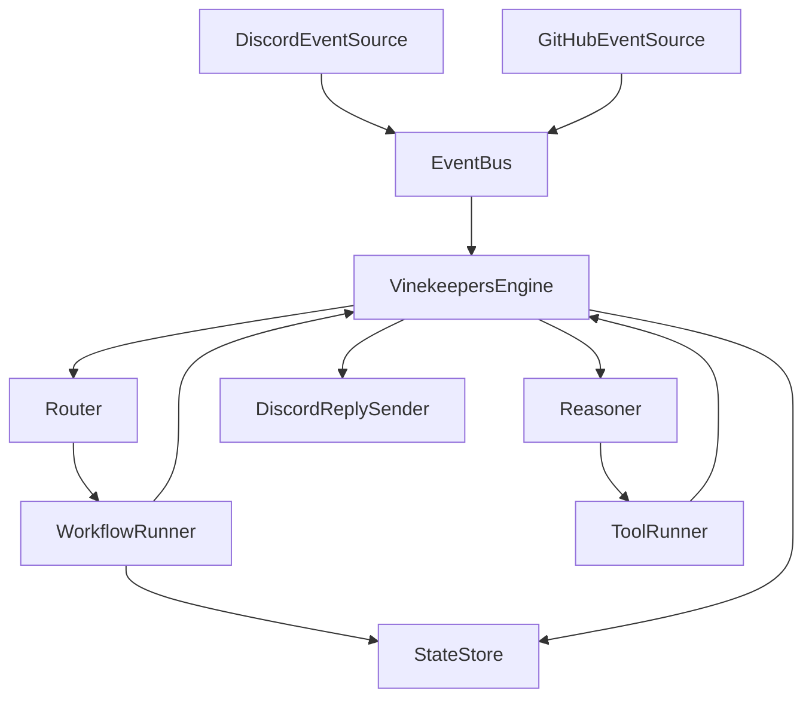

# Architecture

# Overview

Vinekeepers is an event-driven bot framework built around spec-traced Java components and YAML-configured bots. The runtime loads configuration, routes incoming events to matching bots, runs workflow and reasoner stages, executes approved tools, persists per-session state, and sends replies through the active connector path.

# System context

- **External systems:** Discord, GitHub, the local file system for `.env` and `config/bots.yaml`, and the Java 21 plus Maven runtime.
- **Boundaries:** Connectors translate external payloads into internal `Event` objects, the engine orchestrates routing and execution, and outbound side effects are limited to approved tools or connector reply interfaces.

# Major subsystems

- **Core runtime:** `VinekeepersApp`, `Bootstrap`, `VinekeepersEngine`, `EventBus`, `Router`, and `ConfigLoader` wire the application and coordinate the per-event execution loop.
- **Bot model:** `BotDefinition`, `Persona`, `ModelProfile`, `Routing`, `ToolPolicy`, `MemoryPolicy`, `ConversationMode`, and normalized event context define how each bot behaves and what it can do.
- **Workflow and state:** `WorkflowRunnerFactory`, `WorkflowRunner`, `ConfigurableWorkflowRunner`, step implementations, session key strategies, and `StateStore` support multi-turn and single-event flows.
- **Reasoner and tools:** `ReasonerInput`, `ReasonerOutput`, `ProposedToolCall`, `ToolRegistry`, and `ToolRunner` support policy-checked post-workflow decision making.
- **Connectors:** `DiscordEventSource`, `DiscordReplySender`, and `GitHubEventSource` bridge external systems and internal events.

# Runtime flows

1. Startup loads `.env`, then `Bootstrap` creates the event bus, state store, router, engine, tool registry, and workflow runner factory before starting configured connectors.
2. A connector publishes an `Event`; `VinekeepersEngine` receives it and asks `Router` to match the event against normalized routing filters and bot definitions.
3. For each matching bot, the engine runs the registered `WorkflowRunner`. Configured workflows load state via the bot's session key strategy, execute steps, and can continue, wait for more input, complete, or return an error outcome.
4. When the workflow stage does not fully resolve the interaction, the engine builds `ReasonerInput` from workflow context, current state, and the normalized last user message, then invokes the bot's `Reasoner`.
5. The engine persists state changes, executes approved workflow or reasoner tool calls through `ToolRunner`, records audit information, and sends the final reply through `DiscordReplySender` when the source is Discord.

# Diagram

