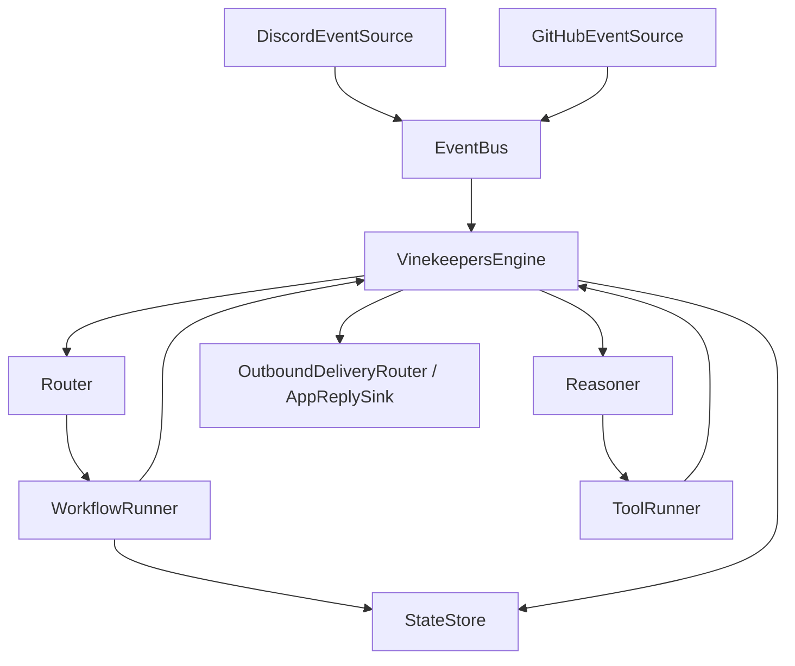

# Architecture

# Overview

Vinekeepers is an event-driven bot framework built around spec-traced Java components and YAML-configured bots. The runtime loads configuration, routes incoming events to matching bots, runs workflow and reasoner stages, executes approved tools, persists per-session state, and sends replies through the active connector path.

# System context

- **External systems:** Discord, GitHub, the local file system for `.env` and `config/bots.yaml`, and the Java 21 plus Maven runtime.
- **Boundaries:** Connectors translate external payloads into internal `Event` objects, the engine orchestrates routing and execution, and outbound side effects are limited to approved tools or connector reply interfaces.

# Major subsystems

- **Core runtime:** `VinekeepersApp`, `Bootstrap`, `VinekeepersEngine`, `EventBus`, `Router`, and `ConfigLoader` wire the application and coordinate the per-event execution loop.
- **Interactions and reply:** Package `com.vinekeepers.interactions` provides platform-neutral reply model: `OutboundResponse`, `ResponseIntent` (PresentChoices, ConfirmAction, CollectText, CollectForm, ShowActions, ShowStatus), `ReplyTarget` (ChannelTarget, InteractionTarget), `Capabilities`, and the connector contract `AppReplySink` (respondImmediately, sendFollowUp, updateMessage, openModal, getCapabilities).
- **Bot model:** `BotDefinition`, `Persona`, `ModelProfile`, `Routing`, `ToolPolicy`, `MemoryPolicy`, `ConversationMode`, and normalized event context define how each bot behaves and what it can do.
- **Workflow and state:** `WorkflowRunnerFactory`, `WorkflowRunner`, `ConfigurableWorkflowRunner`, step implementations, session key strategies, and `StateStore` support multi-turn and single-event flows.
- **Reasoner and tools:** `ReasonerInput`, `ReasonerOutput`, `ProposedToolCall`, `ToolRegistry`, and `ToolRunner` support policy-checked post-workflow decision making.
- **Connectors:** **ConnectorRegistry** (register/get adapters by connector id), **ConnectorAdapter** (registerBots(bots, ConnectorContext)), and **ConnectorContext** (EventBus, OutboundDeliveryRouter; no connector-named fields) provide a generic adapter layer. **DiscordConnectorConfig** and **DiscordConnectorAdapter** hold Discord-specific options and implement per-bot gateway/sender registration; Bootstrap creates the registry and adapter and calls adapter.registerBots(bots, context); sink and action registration remain in Bootstrap. `DiscordEventSource`, `DiscordReplySender`, `DiscordAppReplySink`, **OutboundDeliveryRouter**, and `GitHubEventSource` bridge external systems and internal events. The engine uses the connector **AppReplySink** contract (lifecycle operations) for rich replies; the Discord sink uses **OutboundDeliveryRouter** to resolve the reply sender from the delivery target and optional lifecycle context (`configuredBotId`)—for lifecycle channels only the configured bot's sender is used, with no silent fallback when that sender is unavailable. Per-bot Discord identity is connector-scoped via `BotDefinition.getConnectorIdentity("discord")` (e.g. tokenEnvKey, handlesOwnedSpaces); config prefers `identities.discord` in YAML with legacy top-level keys supported. Discord adapter owns platform timing and may auto-defer on interaction receive. The Discord gateway exposes `createTextChannel(guildId, channelName)` for lifecycle room creation; workflows use the `create_channel` action, which delegates to the gateway.
- **Lifecycle room (Phase 1):** Provisioning is workflow-driven via registered actions: `create_channel` and `create_thread` use request DTOs (**CreateRoomRequest**, **CreateThreadRequest**) with explicit intent fields; **CreateRoomRequest** may include optional **participantBotIds** (multi-bot permissions); a request factory performs bind/state resolution; actions resolve **SpaceOperations** via **WorkflowCapabilitySupport.sourcePrefix(event)** — **fail-closed** capability lookup (null/blank or unregistered prefix returns sentinel; no Discord default). **SpaceOperations** returns **CreateRoomResult** and **CreateThreadResult** (typed success with id or failure with reason); workflow actions translate to id or sentinel for state. SpaceOperations uses a **request-based API** (`createRoom(CreateRoomRequest)`, `createThread(CreateThreadRequest)`). **DiscordSpaceOperations** implements for Discord; createRoom applies permission overwrites for each **participantBotIds** entry (or single lifecycleOwnerBotId). Other actions: `create_lifecycle_context`, `provision_bot_instance` (e.g. Arrietty), **provision_room_participants** (storeIn: featureRoomParticipants), **initialize_feature_room_state** (builds **FeatureRoomState** in **FeatureRoomStateStore**), `post_channel_message` (asRole/asBotId with strict explicit sender via sendAsExplicit/sendAsRoleExplicit), and `launch_cursor_run`. Run state uses `LifecycleRunRecord`; context uses `LifecycleContext` and `LifecycleContextStore`; **multi-bot feature room** uses **FeatureRoomState** and **FeatureRoomStateStore**. **Arrietty (Orchestrator)** is the primary coordinator; four participants (arrietty, architect, auditor, scribe). **Response policy:** room channel is coordinator-centric; intake thread routes all four bots for structured collaboration; Luna uses explicit thread **post_channel_message** steps per role. The Arrietty bot in config is the template for per-channel lifecycle room instances.

# Runtime flows

1. Startup loads `.env`, then `Bootstrap` creates the event bus, state store, router, engine, tool registry, and workflow runner factory before starting configured connectors.
2. A connector publishes an `Event`; `VinekeepersEngine` receives it and asks `Router` to match the event. The Router **first** collects every `botId` whose routing filter matches the event. For Discord events with a non-blank channel id, it then applies **overrides** in order: if **FeatureRoomStateStore** matches the channel as an **intake/spec thread**, it returns participant configuredBotIds in stable role order; if it matches the **room** channel, it returns only the primary **coordinator**; otherwise, if **LifecycleContextStore** applies and the owner has `handlesOwnedSpaces`, it returns only the owner (with a warning and filter-based routing if the owner lacks `handlesOwnedSpaces`). If no override applies, it returns the deduped filter match list.
3. For each matching bot, the engine runs the registered `WorkflowRunner`. Configured workflows load state via the bot's session key strategy, execute steps, and can continue, wait for more input, complete, or return an error outcome.
4. When the workflow stage does not fully resolve the interaction, the engine builds `ReasonerInput` from workflow context, current state, and the normalized last user message, then invokes the bot's `Reasoner`.
5. The engine persists state changes, executes approved workflow or reasoner tool calls through `ToolRunner`, records audit information, builds an `OutboundResponse` from workflow or reasoner (rich or text-only), obtains a `ReplyTarget` via connector-owned **ReplyTargetResolver** by connector id (Discord resolver in connectors; fail closed when no resolver or resolver returns empty), and delivers the reply through the connector **sink** registered for the event source (by sourceId prefix); reply-sender fallback uses target.channelId()/messageId(). When a sink is registered, the engine calls it (e.g. Discord uses **OutboundDeliveryRouter** to resolve the sender: by default the primary sender; for lifecycle channels the router uses the lifecycle context's `configuredBotId` and that bot's registered sender only—no silent fallback if unavailable). The engine calls sink lifecycle methods (`respondImmediately`, `sendFollowUp`, `updateMessage`) when it has content; **defer is adapter-owned only**—the engine never requests or triggers defer. When no sink is registered for the source, the engine uses the **reply sender** for that source's prefix (e.g. Bootstrap registers `engine.setReplySender("discord", outboundDeliveryRouter)`); the engine has **no connector-specific literals** and resolves fallback by source prefix only. Workflow actions such as `post_channel_message` send to a channel from state (e.g. after provisioning a lifecycle room) via the connector.

# Diagram

# Rich interactions

Reply delivery uses a **connector sink** contract (`AppReplySink`) with distinct lifecycle operations: `respondImmediately`, `sendFollowUp`, `updateMessage`, `openModal`. Workflows and reasoners may produce an `OutboundResponse` (optional text, optional platform-neutral intent such as present_choices or confirm_action). The engine obtains `ReplyTarget` via connector-owned **ReplyTargetResolver** by connector id (Discord resolver in connectors; fail closed when no resolver or resolver returns empty); reply delivery uses target.channelId()/messageId(). The engine calls the appropriate sink method with the resolved target. **Transitional** sink resolution is by sourceId prefix (e.g. `discord`); a longer-term target is an explicit connector/surface reference. The Discord adapter is responsible for acknowledging or deferring interactions within Discord's 3s window; when the adapter has already deferred, the engine sends content via `sendFollowUp` or `updateMessage`. See [Discord](features/domain/connectors/discord.md) and workflow step docs for intent-based steps and capture from interactions.

