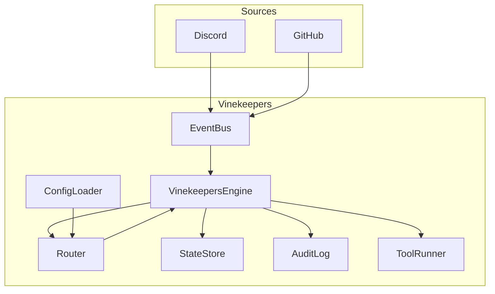

# Architecture

# Overview

Vinekeepers is an event-driven bot framework. The application bootstraps an engine that receives events, routes them to bots by configuration, and runs a core loop: load context, reason (LLM or rules), act via tools, persist state, and respond. Bots are defined in YAML and composed of persona, model profile, workflow, tool policy, and routing rules.

# System context

- **External systems:** Discord (optional), GitHub (optional), file system (.env, YAML config), Maven/Java runtime.
- **Boundaries:** Event sources push internal events onto the event bus; the engine and bots do not call out except through approved tools (e.g. Discord reply, GitHub comment).

# Major subsystems

- **Core:** Entrypoint (VinekeepersApp), Bootstrap, VinekeepersEngine, event bus, router, config loader. Domain: core.
- **Connectors:** DiscordEventSource, GitHubEventSource (implement EventSource). DiscordEventSource also implements DiscordReplySender; the engine sends workflow replies back to Discord via this interface. Domain: core.
- **Bot model:** BotDefinition, Persona, ModelProfile, Routing, ToolPolicy, MemoryPolicy. Domain: core.
- **State and audit:** StateStore, AuditLog, AuditRecorder. Domain: core.
- **Tools and reasoner:** Tool, ToolRegistry, ToolRunner, Reasoner (and stubs). Domain: core.

# Runtime flows

1. Application starts: load .env → Bootstrap wires engine, config loader, state store, audit log, tool registry; engine subscribes to event bus; connectors start and publish events.
2. Event arrives: engine receives it, router matches to zero or more bots; for each bot, the engine gets the registered WorkflowRunner for that botId and calls runner.run(event, stateStore, botId) (load state, run workflow, persist, return reply), then reasoner if needed, enforce tool policy, execute approved tools, persist state and audit, emit responses. Runners are created at bootstrap by WorkflowRunnerFactory from each bot's workflow.type (stub or configured). For type **configured**, the factory builds ConfigurableWorkflowRunner from the YAML **workflows:** section (workflow.params.workflowRef or inline steps) and a WorkflowActionRegistry; Bootstrap registers Cursor actions (e.g. cursor.fullRun, cursor_cloud, echo) for CallActionStep. Luna uses configured workflow **luna_cursor**. ConfigurableWorkflowRunner runs WorkflowDefinition steps in order: ask_input, call_action, branch, done; state is ConfigurableWorkflowState (step index + key-value store). When the event source is Discord, workflow replies are sent back via DiscordReplySender.
3. Config: ConfigLoader reads YAML; bot definitions include workflow.type and optional workflow.params (for configured: workflowRef or inline steps). A top-level **workflows:** section defines the step DSL (id → steps: ask_input, call_action, branch, done). Bootstrap creates a WorkflowActionRegistry, registers Cursor actions, creates a WorkflowRunner per bot via WorkflowRunnerFactory, and registers it with the engine; routing filters (Discord/GitHub, etc.) determine which events each bot sees.

# Diagram

