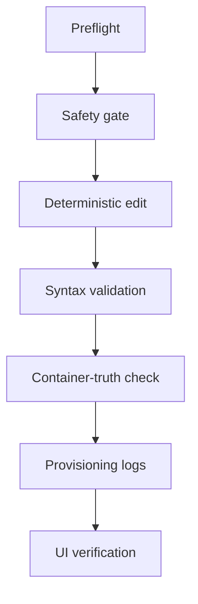

# Nova Grafana

## Summary

Implements Grafana dashboard and provisioning changes reliably for Datavine using a safe workflow: preflight, deterministic JSON edits, syntax validation, container-truth checks, provisioning log diagnostics, and UI verification. Use when editing Grafana dashboards, panel layouts, stat tiles, row nesting, Prometheus datasource references, or when provisioning appears to ignore or revert changes.

## Key points

- **Scope:** Grafana project path, provisioned dashboard JSON, provider config (paths in SKILL.md).
- **Workflow:** Preflight → safety gate (prefer stop Grafana before edit) → deterministic edit (structured JSON) → syntax validation → container-truth verification → provisioning diagnostics → UI verification.
- **Safety:** Prefer stop/edit/validate/start sequence; do not rely on host file state alone—verify inside container.
- **Known failure modes:** Malformed JSON, wrong container path, top-level sibling panels for row details, UID rename cycles creating duplicates, byIndex field overrides unsupported.

## Diagram



## Sub-skills

- [Checklist](nova-grafana/checklist.md) — Preflight and verification checklist for every Grafana edit

## Skill source (markdown)

<details class="skill-source-wrap"><summary>Click to expand</summary>

```markdown
---
name: nova-grafana
description: Implements Grafana dashboard/provisioning changes reliably for Datavine using a safe workflow: preflight, deterministic JSON edits, syntax validation, container-truth checks, provisioning log diagnostics, and UI verification. Use when editing Grafana dashboards, panel layouts, stat tiles, row nesting, Prometheus datasource references, or when provisioning appears to ignore/revert changes.
disable-model-invocation: true
---

# Nova Grafana (Datavine)

Reliable workflow for Grafana provisioning changes in this environment.

## Scope

- Grafana project path: `/home/perfect_edge13/Docker/grafana`
- Provisioned dashboard file: `/home/perfect_edge13/Docker/grafana/provisioning/dashboards/json/status.json`
- Provider config: `/home/perfect_edge13/Docker/grafana/provisioning/dashboards/default.yml`

## Workflow

### 1) Preflight (always)

1. Read the current dashboard JSON and provider YAML.
2. Confirm provider path points to `/etc/grafana/provisioning/dashboards/json`.
3. Confirm target dashboard `uid` and title before editing.

### 2) Safety gate (critical)

- If Grafana is running, provisioning scans may make edits appear inconsistent while debugging.
- Preferred sequence for high-confidence updates:
  1. Stop Grafana.
  2. Edit + validate files.
  3. Start Grafana.
  4. Verify in-container file + logs.

### 3) Edit method (deterministic, not brittle)

- Prefer structured JSON edits (load/mutate/dump) over raw string replace for complex panel changes.
- Keep dashboard identity stable unless explicitly requested:
  - Keep `uid` stable (do not use a UID rename cycle to force overwrite—it creates duplicate dashboards).
  - Increment `version` after substantive changes.
- For repeated/app tiles and Datavine tile:
  - Use explicit `gridPos` so tile sizes are consistent.
  - Avoid duplicate Datavine tile by excluding Datavine from repeated app query when using dedicated Datavine tile.
- For collapsed rows:
  - Put detail panels inside the row's `panels` array.
  - Do not leave detail tables as top-level sibling panels.
- Row panels (`type: "row"`) must **not** have a `datasource` property; remove it if present (e.g. from the repeating `$app` row). It can cause provisioning parse errors.
- Datavine row (id 200): use `gridPos.y: 6` so it does not overlap the Overview row at y=0.

### 4) Syntax validation (hard gate)

- Run JSON validation immediately after edits:
  - `python3 -m json.tool "/home/perfect_edge13/Docker/grafana/provisioning/dashboards/json/status.json"`
- Do not restart Grafana until validation passes.

### 5) Container-truth verification (hard gate)

Host file state is not enough. Verify inside container:

1. `sudo docker compose exec grafana sh -lc 'ls -l /etc/grafana/provisioning/dashboards/json/status.json'`
2. `sudo docker compose exec grafana sh -lc 'sed -n "1,260p" /etc/grafana/provisioning/dashboards/json/status.json'`
3. Confirm expected keys exist in container copy:
   - expected `uid`
   - expected panel IDs/titles
   - expected row nesting

### 6) Provisioning diagnostics (hard gate)

Check provisioning logs after startup:

- `sudo docker compose logs grafana 2>&1 | grep -i -E "provision|dashboard|failed|error"`

If you see parse errors (example: `invalid character ':' after array element`):

1. Stop Grafana.
2. Re-validate JSON with `python3 -m json.tool`.
3. Fix malformed JSON using deterministic rewrite.
4. Start Grafana and re-check logs.

### 7) UI verification checklist

Verify all requested behavior in UI:

- Top status tile presence and sizing (Datavine + repeated app tiles).
- Correct section headers (including capitalization/wording).
- Datavine section collapsed by default.
- Datavine detail table is nested under Datavine row.
- Datavine columns are correctly labeled (not generic `Value #A/#B/...`).
- Datavine Job details table: Job column is first; Last run and Next run are adjacent.

## Known failure modes and fixes

1. **Dashboard missing despite file existing**
   - Cause: malformed JSON or wrong container-mounted file.
   - Fix: validate JSON + check in-container file path + logs.

2. **Changes appear reverted**
   - Cause: editing host file while troubleshooting with running Grafana and stale assumptions.
   - Fix: use stop/edit/validate/start sequence and verify container copy.

3. **Datavine details row behaves incorrectly**
   - Cause: table panel left as top-level sibling instead of nested row panel.
   - Fix: move table into row `panels`.

4. **Generic table headers (`Value #A/#B/#C`)**
   - Cause: merge transform without explicit display-name overrides.
   - Fix: add field overrides mapping each value column to intended header.

4b. **"byIndex" not found / Datavine section errors on expand**
   - Cause: field override matcher `byIndex` is not supported in all Grafana versions (supported matchers may be: byName, byRegexp, byFrameRefID, byType, etc., but not byIndex).
   - Fix: do not use `"id": "byIndex"` in field overrides in status.json. Use only byName, byRegexp, byFrameRefID, or other matchers from the running Grafana version.

5. **Wrong dashboard loaded**
   - Cause: UID/title mismatch and stale URL.
   - Fix: verify target UID in JSON and open matching dashboard URL.

6. **Duplicate "Services status (scalable)" dashboards (three or more)**
   - Cause: UID rename cycle (e.g. force-reprovision) or multiple provisions created multiple DB rows; Grafana does not remove provisioned dashboards when the file is removed or changed.
   - Fix: **do not** use file-move or API delete (provisioned dashboards cannot be deleted via API). Use the DB script with Grafana **stopped**: `./scripts/delete-status-dashboards-from-db.sh`. It discovers the Grafana data volume from the container mount, then deletes the duplicate dashboard rows (uids: services-status, services-status-scalable, services-status-scalable-tmp) from SQLite. Then start Grafana; the single dashboard from status.json is provisioned. See "Removing duplicate provisioned dashboards" below.

7. **Join + organize: column order or "Job first" not working**
   - Cause: **joinByField** names duplicate columns by frame: the **first frame** keeps the base name (e.g. `exported_job`); **later frames** get suffixes ` 2`, ` 3`, … There is **no** `exported_job 1`. Using `exported_job 1` in indexByName/renameByName targets a non-existent column, so the real job column is never reordered or renamed.
   - Fix: Use the **actual** post-join field name for the first frame's join key: `exported_job` (not `exported_job 1`). In organize: `indexByName: { "exported_job": 0, ... }`, `renameByName: { "exported_job": "Job" }`, and exclude only `exported_job 2` … `exported_job 6`. Use a **single** organize step with indexByName defining the full column order (same pattern that works for reordering e.g. Last run / Next run). Field overrides (byName) must match the field name that exists after transforms—e.g. `"Job"` after rename, or `"exported_job"` before.

## Removing duplicate provisioned dashboards

Grafana does **not** delete provisioned dashboards when you remove or rename the JSON file (see Grafana issues #15716, #41085). The API returns 400 "provisioned dashboard cannot be deleted" for provisioned dashboards. The only reliable fix is to delete the dashboard rows directly from Grafana's SQLite database.

1. **Stop Grafana:** `sudo docker compose stop grafana`
2. **Run the DB script** (from Docker/grafana): `./scripts/delete-status-dashboards-from-db.sh`
   - The script discovers the data volume via `docker inspect grafana` (no hardcoded volume name).
   - It runs an Alpine container with sqlite3 and deletes rows for the three known duplicate uids from `dashboard_provisioning`, `dashboard_version`, `dashboard_acl`, `dashboard_tag`, `star`, and `dashboard`.
3. **Start Grafana:** `sudo docker compose up -d`
4. Open `http://localhost:3000/d/services-status-scalable` — you should have a single dashboard.

**Do not use:** (a) File-move script to "un-provision" — Grafana will not delete the dashboards. (b) UID rename cycle (e.g. force-reprovision.py) — it creates more duplicates. (c) API delete script — it cannot delete provisioned dashboards.
```

</details>
