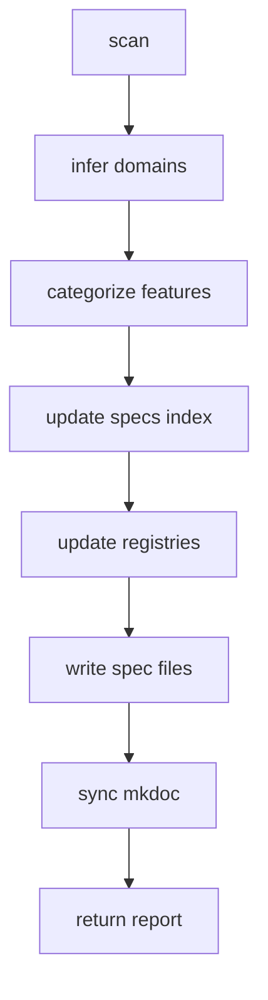

# Nova-spec

## Summary

Runs the **scan-and-update** workflow. Orchestrator follows scan-and-update.md: scan repo, infer domains, categorize features, update specs index and registries, write spec files, sync mkdoc (including Cursor docs). Returns a report per output-format.md.

## Key points

- Run **scan-and-update** step; for update phase (2.1–2.4) run sub-skills inline or via mcp_task.
- Return report: Outcome, Summary, Phases, Specs updated, Mkdoc updated, Domains, Issues/notes.

## Diagram



## Sub-skills

- [scan-and-update](nova-spec/scan-and-update.md)
- [output-format](nova-spec/output-format.md)
- [sub-skills/scan](nova-spec/sub-skills/scan.md)
- [sub-skills/infer-domains](nova-spec/sub-skills/infer-domains.md)
- [sub-skills/categorize-features-to-domains](nova-spec/sub-skills/categorize-features-to-domains.md)
- [sub-skills/update-specs-index](nova-spec/sub-skills/update-specs-index.md)
- [sub-skills/update-registry](nova-spec/sub-skills/update-registry.md)
- [sub-skills/sync-mkdoc](nova-spec/sub-skills/sync-mkdoc.md)

## Skill source (markdown)

<details class="skill-source-wrap">
<summary>Click to expand</summary>

```markdown
---
name: nova-spec
description: Full-repo scan and complete spec + mkdoc update. Use when the user invokes /nova-spec.
---

# Nova-spec

This skill runs the **scan-and-update** workflow. You are the **orchestrator**: follow the workflow and launch sub-agents for sub-skills when appropriate.

**Workflow** — Read **@.cursor/workflows/nova-spec.yml**. Run the step in `run_order` (scan_and_update) by opening and following **@.cursor/skills/nova-spec/scan-and-update.md**.

**How to run:**

1. Run the **scan-and-update** step: follow its phases (scan, update, write, mkdoc, return).
2. For **update phase** steps 2.1–2.4 in that document, you may run each sub-skill **inline** or **launch a sub-agent** (mcp_task) with the sub-skill path and handoff. Prefer sub-agent for **categorize-features-to-domains** and **update-registry** when the workload is large (many domains/features).
3. **Return** Produce the final report using the structure in **@.cursor/skills/nova-spec/output-format.md** (Outcome, Summary, Phases executed, Specs updated, Mkdoc updated, Domains, Issues/notes). All output must conform to specs schema (no new keys).

**Using sub-agents:** For any step that has a sub-skill under `.cursor/skills/nova-spec/sub-skills/`, you may call **mcp_task** with: subagent_type **generalPurpose**; **prompt**: "Run the nova-spec sub-skill at \<path\>. Input/handoff: \<...\>. Return Pass/Fail and short summary."; **description**: "nova-spec: \<step name\>". Collect results before continuing.
```

</details>
