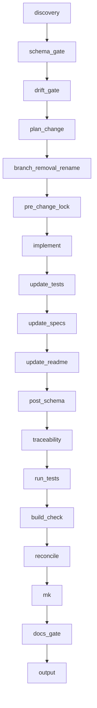

# Nova-code

## Summary

Spec-driven implementation workflow. Discovery → gates → execution loop (plan_change through reconcile, then mk, docs_gate, output). The `update_readme` step uses cumulative handoff to classify impact and **updates root README.md only**; the **mk** step syncs the docs dir (e.g. mkdoc). Branch `removal_rename_sequence` when `plan_change` sets `removal_or_rename`.

## Sequence

1. discovery  
2. schema_gate  
3. drift_gate  
4. plan_change  
5. branch_removal_rename  
6. pre_change_lock  
7. implement  
8. update_tests  
9. update_specs  
10. update_readme  
11. post_schema  
12. traceability  
13. run_tests  
14. build_check  
15. reconcile  
16. mk  
17. docs_gate  
18. output  

## Diagram

