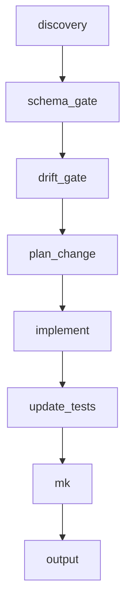

# Nova-code

## Summary

Spec-driven implementation workflow. Discovery → gates → execution loop (plan_change, implement, update_tests, update_specs, post_schema, traceability, run_tests, static_analysis, reconcile, mk, output). Branch removal_rename when plan_change sets removal_or_rename.

## Sequence

1. discovery  
2. schema_gate  
3. drift_gate  
4. plan_change  
5. branch_removal_rename  
6. pre_change_lock  
7. implement  
8. update_tests  
9. update_specs  
10. update_readme  
11. post_schema  
12. traceability  
13. run_tests  
14. static_analysis  
15. reconcile  
16. mk  
17. output  

## Diagram

