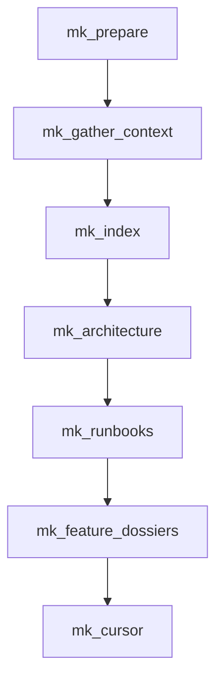

# Nova-mk

## Summary

Sync `mkdoc/` hierarchy and content from specs plus `nova-code` handoff. The workflow bootstraps docs when needed, computes affected features, compresses spec and doc context, refreshes index and architecture pages, updates runbooks and scoped feature dossiers, and finally syncs Cursor docs.

## Sequence

1. `mk_prepare`
2. `mk_gather_context`
3. `mk_index`
4. `mk_architecture`
5. `mk_runbooks`
6. `mk_feature_dossiers`
7. `mk_cursor`

## Diagram

## Phases

- `mk_prepare`: bootstrap docs if needed, load specs, classify update types, and compute affected features from `plan_change` plus `implement`.
- `mk_gather_context`: compress scoped spec and existing mkdoc content into a reusable handoff bundle.
- `mk_index`, `mk_architecture`, `mk_runbooks`: refresh shared documentation pages.
- `mk_feature_dossiers`: update scoped feature summary and sub-pages.
- `mk_cursor`: sync `.cursor` rules, skills, workflows, and nav into docs.

