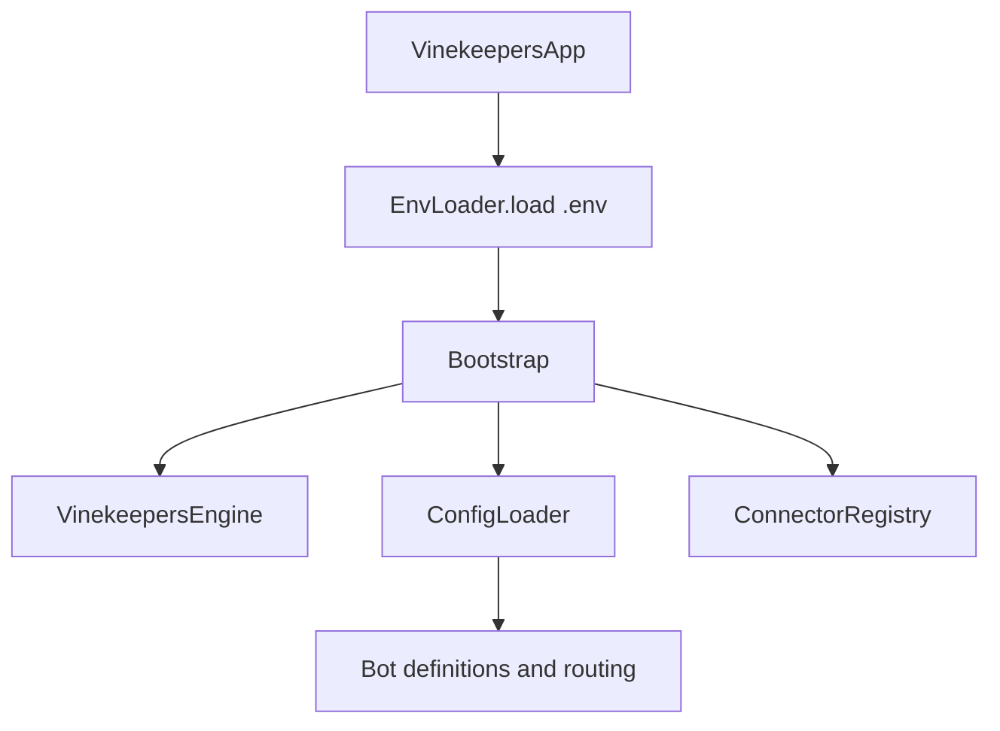

# Diagrams

# Architecture

See the main [Architecture](../../../../architecture.md) page for system context and runtime flow.

# Feature flow

```mermaid
flowchart TB
  App[VinekeepersApp] --> LoadEnv[EnvLoader.load .env]
  LoadEnv --> Bootstrap[Bootstrap]
  Bootstrap --> Engine[VinekeepersEngine]
  Bootstrap --> Config[ConfigLoader]
  Bootstrap --> Connectors[ConnectorRegistry]
  Config --> Bots[Bot definitions and routing]
```
