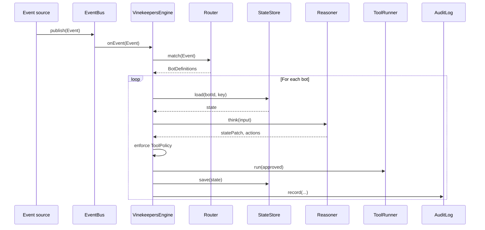

# Diagrams

# Architecture

See [Architecture](../../../../architecture.md) for the main system diagram (event sources → event bus → engine → router, state, audit, tools).

# Feature flow

```mermaid
sequenceDiagram
  participant Source as Event source
  participant Bus as EventBus
  participant Engine as VinekeepersEngine
  participant Router as Router
  participant State as StateStore
  participant Reasoner as Reasoner
  participant Tools as ToolRunner
  participant Audit as AuditLog
  Source->>Bus: publish(Event)
  Bus->>Engine: onEvent(Event)
  Engine->>Router: match(Event)
  Router-->>Engine: BotDefinitions
  loop For each bot
    Engine->>State: load(botId, key)
    State-->>Engine: state
    Engine->>Reasoner: think(input)
    Reasoner-->>Engine: statePatch, actions
    Engine->>Engine: enforce ToolPolicy
    Engine->>Tools: run(approved)
    Engine->>State: save(state)
    Engine->>Audit: record(...)
  end
```
