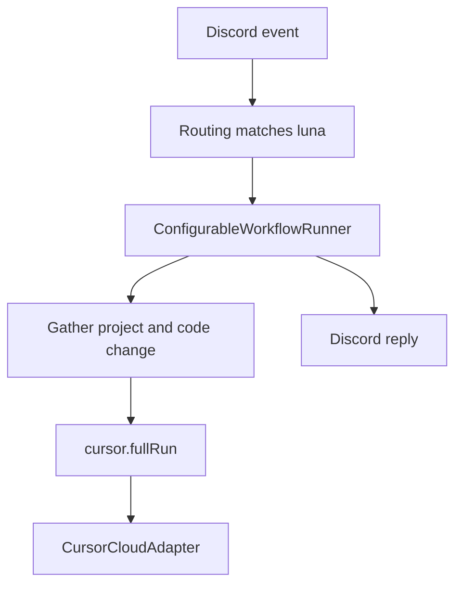

# Diagrams

# Architecture

See [Architecture](../../../../architecture.md) for the main system diagram.

# Feature flow

```mermaid
flowchart TB
  Discord[Discord event] --> Routing[Routing matches luna]
  Routing --> Runner[ConfigurableWorkflowRunner]
  Runner --> Gather[Gather project and code change]
  Gather --> Tool[cursor.fullRun]
  Tool --> Adapter[CursorCloudAdapter]
  Runner --> Reply[Discord reply]
```

