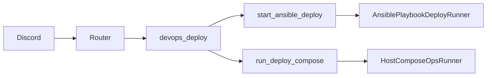

# Diagrams

# Architecture

See [Vinekeepers architecture](../../../../architecture.md) for system context. This feature sits in the workflow + devops packages and uses Discord as the operator surface.

# Feature flow

