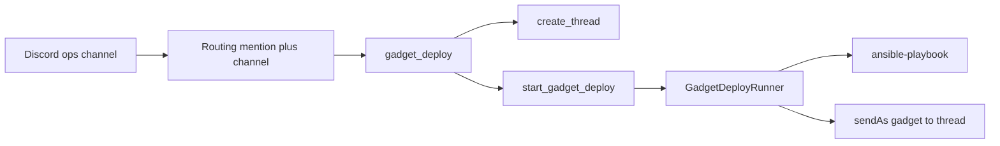

# Diagrams

```mermaid
flowchart LR
  Discord[Discord ops channel] --> Router[Routing mention plus channel]
  Router --> Workflow[gadget_deploy]
  Workflow --> Thread[create_thread]
  Workflow --> Start[start_gadget_deploy]
  Start --> Runner[GadgetDeployRunner]
  Runner --> Ansible[ansible-playbook]
  Runner --> DiscordOut[sendAs gadget to thread]
```
