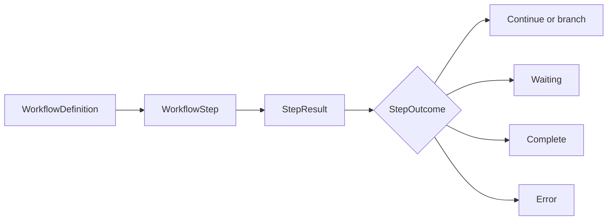

# Diagrams

# Context

```mermaid
flowchart LR
  Def[WorkflowDefinition] --> Step[WorkflowStep]
  Step --> Result[StepResult]
  Result --> Outcome{StepOutcome}
  Outcome --> Continue[Continue or branch]
  Outcome --> Wait[Waiting]
  Outcome --> Complete[Complete]
  Outcome --> Error[Error]
```

